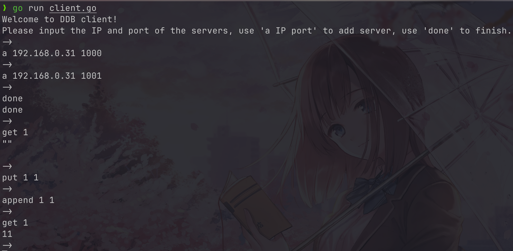

# DDB - Toy distributed KV storage system

## A naive and simple distributed KV storage system based on Raft consensus algorithm built from labs of mit 6.5840 Distributed Systems course. Supports basic operations such as put, get append and write.

